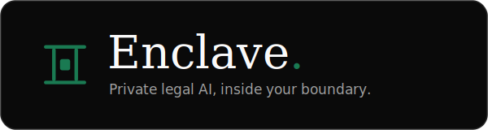

<p align="center">
  
</p>

# Enclave — Self-Hosted Private Legal AI for Law Firms & In-House Teams

> **Enclave is a self-hosted, private legal AI platform that runs entirely inside your own cloud (VPC) or on-premise — so your contract corpus, drafts, matter files, and client data never leave your security boundary.** AI co-counsel, contract review, due diligence, and drafting, grounded in *your* firm's documents and standards — not a public model's memory, and never used to train anyone else's model.

Enclave gives law firms, in-house legal teams, and M&A diligence groups a **whitelabeled, fully private AI workforce**: ask questions across your entire contract corpus, run extractions over thousands of documents, review and redline against your own playbook, draft in your firm's voice, and schedule autonomous agents — all behind your own firewall, under your own access controls.

---

## Contents

| Section | What's inside |
| --- | --- |
| **[Why self-hosted, private AI](#why-self-hosted-private-ai)** | The privacy & compliance case for in-VPC legal AI |
| **[How it's built](#how-its-built)** | The Onyx · Paperclip · LiteLLM substrates |
| **[Features](#features)** | What ships today, and what's on the roadmap |
| **[Who it's for](#who-its-for)** | Target teams and use cases |
| **[Get started](#get-started)** | Run the full stack locally or in your VPC |
| &nbsp;&nbsp;↳ [Prerequisites](#prerequisites) | What you need installed |
| &nbsp;&nbsp;↳ [Run the backend](#run-the-backend) | Onyx RAG + an in-VPC Ollama LLM |
| &nbsp;&nbsp;↳ [Configure the LLM provider](#configure-the-llm-provider) | Point Onyx at your local model |
| &nbsp;&nbsp;↳ [Run the Enclave app](#run-the-enclave-app) | The Next.js front-end |
| &nbsp;&nbsp;↳ [LLM runtime modes](#llm-runtime-modes) | CPU · NVIDIA GPU · native Ollama |
| &nbsp;&nbsp;↳ [Hardware guide](#hardware-guide) | RAM/VRAM per model |
| **[Preview the interface](#preview-the-interface)** | Static UI prototypes, no build step |
| **[Keywords](#keywords)** | — |

---

## Why self-hosted, private AI

Legal work is privileged, confidential, and often contractually restricted from leaving a controlled environment. Public chatbots and multi-tenant SaaS break that model. Enclave is built the other way around:

- **Self-hosted in your VPC or on-prem** — deploy into AWS, Azure, GCP, or your own datacenter. Zero bytes of your data ever leave your boundary.
- **No training on your data** — your contracts and work product are never used to train shared or third-party models. Your corpus stays yours.
- **Attorney–client privilege preserved** — privileged and confidential material is processed inside the boundary you already trust, supporting confidentiality, professional-responsibility, and data-residency obligations.
- **Bring your own model** — route to a local open-weight LLM (Ollama), your own Amazon Bedrock / Azure OpenAI tenancy, or Claude, through a single LLM gateway (LiteLLM). No lock-in.
- **Your access controls** — document-level ACLs, SSO/SAML, and role-based access mean the AI only ever sees what a given user is allowed to see.
- **Auditable & governed** — every retrieval, answer, and agent run is logged for review, supervision, and compliance.

**Compliance posture:** SOC 2 Type II (in progress) · GDPR-ready · MIT open-core foundations · fully self-hosted.

---

## How it's built

Enclave integrates two open-source substrates and wraps them in a branded, legal-specific product layer:

- **Onyx** — the knowledge substrate. Retrieval-augmented generation (RAG) over your entire contract corpus, with 50+ enterprise connectors, document-level ACLs, and pin-cited, source-grounded answers.
- **Paperclip** — the agent substrate. Orchestration, scheduling, governance, and audit for multi-step legal workflows — an always-on AI workforce.
- **LiteLLM gateway** — model routing across local Ollama, BYO Bedrock/Azure, and Claude.

Everything runs side-by-side **inside your VPC**, connected to the systems you already use: iManage, NetDocuments, SharePoint, network drives, S3, your CLM, and email.

```
Enclave (Next.js · :3000)  ──►  Onyx API (· :8080)  ──►  Ollama (· :11434)
        product UI               retrieval + RAG          local LLM, in-VPC
```

---

## Features

### Available in the product

- **AI Assistant (co-counsel)** — multi-turn conversational AI grounded in your corpus, with pin-cited sources and hand-offs to Diligence, Agents, and Draft.
- **Research — corpus-wide Q&A** — ask natural-language questions of your firm's whole contract corpus and get pin-cited answers with a source viewer and highlighted spans.
- **Diligence — multi-document extraction grid** — rows are documents, columns are extraction prompts; run structured extractions across thousands of contracts in a spreadsheet-style grid and export to CSV.
- **Review — clause review vs. playbook** — single-document review with severity-ranked clause findings and redlines grounded in your firm's playbook.
- **Playbooks — codified firm standards** — author rules with preferred / acceptable / fallback positions, severity, escalation, and trigger language, auto-generated from your executed precedents and consumed by Review, Assistant, and Agents.
- **Draft — AI drafting in your voice** — generate contracts and clauses from your executed precedents, with an editor canvas, precedent rail, and clause library.
- **Agents / Workflows — autonomous AI workforce** — scheduled agents that run 24/7 inside your VPC: auto-renewal watch, portfolio drift monitoring, obligation tracking, and custom agents described in plain English.
- **Connectors & ingestion** — connect your DMS, CLM, drives, and email; watch live in-VPC indexing and per-source sync status.
- **Dashboard** — an AI-forward home with an "ask your AI" box, capability tiles, KPI strip, a needs-attention band, and per-module activity.

### On the roadmap

We are actively building toward:

- **Negotiation copilot** — inline redline suggestions and counterparty-position comparison against your playbook, with one-click fallback language.
- **Obligation & deadline extraction** — automatic extraction of renewals, notice windows, and covenants, synced to calendars and alerts.
- **Clause library & clause comparison** — a managed, versioned library with side-by-side clause diffing across your corpus.
- **Privilege & PII detection / redaction** — automated flagging and redaction of privileged and personal data before sharing or export.
- **Conflict checks** — corpus-aware conflict-of-interest screening.
- **Approval & escalation routing** — configurable approval workflows tied to playbook severity and approver roles.
- **Governance & risk analytics** — dashboards on contract risk posture, deviation rates, and turnaround time.
- **Enterprise identity** — SSO/SAML, SCIM provisioning, and granular RBAC.
- **Firm-tuned models** — optional private fine-tuning / adapters trained only on your corpus, inside your boundary.
- **Integrations & API** — deeper CLM/DMS sync, e-signature, plus a public API and webhooks for embedding Enclave in your own systems.
- **Multi-language contracts** — review, extraction, and drafting across major contract languages.

---

## Who it's for

In-house legal · M&A and transactional diligence · BigLaw · procurement and vendor management · mid-market firms — any team that needs frontier AI on confidential legal work **without** sending that work to a third party.

---

## Get started

Enclave is a **Next.js front-end** that talks to a self-hosted **Onyx** backend (retrieval + RAG), which in turn calls a **local Ollama LLM** — so no document or prompt ever leaves your boundary. Stand up the backend first, point it at a local model, then run the app.

### Prerequisites

- **Docker** + **Docker Compose** — for the Onyx backend and the in-VPC Ollama service.
- **[Bun](https://bun.sh)** ≥ 1.1 (or **Node** ≥ 20) — for the Next.js app.
- **~16 GB RAM** recommended for a usable local model — see the [hardware guide](#hardware-guide).

### Run the backend

Onyx ships its own Compose stack; Enclave layers a small override on top (it publishes the API and adds an in-VPC Ollama service) plus an idempotent seed script. Both live in this repo under [`deploy/docker_compose/`](./deploy/docker_compose/).

```bash
# 1. Get Onyx's deployment stack
git clone https://github.com/onyx-dot-app/onyx.git
cd onyx/deployment/docker_compose

# 2. Drop in Enclave's override + seed (ENCLAVE_REPO = path to this repo)
cp "$ENCLAVE_REPO"/deploy/docker_compose/docker-compose.override.yml .
cp "$ENCLAVE_REPO"/deploy/docker_compose/docker-compose.gpu.yml .       # optional (Linux + NVIDIA)
cp "$ENCLAVE_REPO"/deploy/docker_compose/enclave_seed_ollama.py .

# 3. Bring up the stack (CPU default; Compose auto-merges the override)
docker compose up -d
```

The override publishes the Onyx API on **:8080** and runs Ollama at `http://ollama:11434` inside the Compose network. (Container names below assume the default `onyx` Compose project.)

### Configure the LLM provider

Pull a model and register it with Onyx as the default. The seed runs **inside** the `api_server` container because it writes through Onyx's DB layer:

```bash
# Pull the default model into the in-stack Ollama
docker exec onyx-ollama-1 ollama pull llama3.2:3b

# Seed Onyx's LLM provider (idempotent — safe to re-run)
docker cp enclave_seed_ollama.py onyx-api_server-1:/tmp/enclave_seed_ollama.py
docker exec onyx-api_server-1 python /tmp/enclave_seed_ollama.py
```

Override the model or endpoint without editing code — the seed reads these env vars:
`ENCLAVE_OLLAMA_DEFAULT_MODEL`, `ENCLAVE_OLLAMA_MODELS`, `ENCLAVE_OLLAMA_API_BASE`.

If you run Onyx with `AUTH_TYPE=disabled` (no login — the local-dev default), enable anonymous API access once so the app can reach Onyx without a key:

```bash
docker exec onyx-cache-1 redis-cli set public:anonymous_user_enabled 1 EX 2592000
```

### Run the Enclave app

```bash
# from this repo's root
bun install
cp .env.local.example .env.local      # then edit if your Onyx API isn't on :8080
bun dev                               # http://localhost:3000
```

`.env.local` only needs the Onyx API base (`ONYX_API_URL`, default `http://localhost:8080`); add `ONYX_API_KEY` only if you run Onyx with auth enabled. See [`.env.local.example`](./.env.local.example).

### LLM runtime modes

In-stack Ollama is the default because it's one `docker compose up` with no host-level install and behaves identically on Linux, macOS, and Windows. Pick a mode by how the host is resourced:

| Mode | How | Best for |
| --- | --- | --- |
| **CPU (default)** | `docker compose up -d` | Any machine without a GPU (incl. Macs). Slowest — keep to a small model. |
| **NVIDIA GPU** | add `-f docker-compose.gpu.yml` (see below) | Linux servers — the realistic VPC posture. Needs the NVIDIA Container Toolkit. Fast enough for `llama3.1:8b`+. |
| **Native Ollama** | run Ollama on the host, re-seed with `ENCLAVE_OLLAMA_API_BASE=http://host.docker.internal:11434` | macOS (Metal GPU + full host RAM) — Docker Desktop has no GPU passthrough. |

The GPU overlay must be listed explicitly, which turns off Compose's auto-merge of the override — so include it too:

```bash
docker compose -f docker-compose.yml \
               -f docker-compose.override.yml \
               -f docker-compose.gpu.yml up -d
```

### Hardware guide

Approximate memory the model needs, *on top of* the Onyx stack's ~6.5 GB. CPU inference is usable but slow; a GPU is roughly 10–50× faster.

| Model | Needs ~ | Notes |
| --- | --- | --- |
| `llama3.2:1b` | ~2 GB | Fits a stock Docker Desktop, but too weak for Onyx's agentic prompt — low-memory fallback only. |
| `llama3.2:3b` | ~4 GB | **Default.** Usable answers; on a Mac, raise Docker Desktop memory to ~12–16 GB before selecting it. |
| `llama3.1:8b` | ~8 GB | Recommended for real use; comfortable on a GPU or native on a 16 GB+ host. |

---

## Preview the interface

The UI prototypes live in [`wireframe/`](./wireframe/). They are static HTML with no build step — open [`wireframe/index.html`](./wireframe/index.html) directly in a browser, or serve the folder:

```bash
cd wireframe
python3 -m http.server 8000
# then visit http://localhost:8000
```

---

## Keywords

self-hosted legal AI · private legal AI · on-premise legal AI · in-VPC legal AI · confidential AI for lawyers ·
secure legal AI platform · whitelabel legal AI · AI co-counsel · contract review software · AI contract review ·
AI due diligence · M&A due diligence automation · legal document automation · contract drafting AI ·
clause extraction · clause comparison · contract playbook software · redlining automation · negotiation copilot ·
legal research AI · retrieval-augmented generation · RAG for legal · contract corpus search · contract analytics ·
obligation management · legal workflow automation · AI agents for legal · law firm AI · in-house legal AI ·
LegalTech · LegalAI · data residency · attorney-client privilege · GDPR · SOC 2 · self-hosted AI · VPC deployment ·
bring your own model · open-source legal AI · Onyx · Paperclip.

---

<p align="center">
  Powered by <a href="https://neuralchainai.com"><strong>NeuralChainAI</strong></a>
</p>
